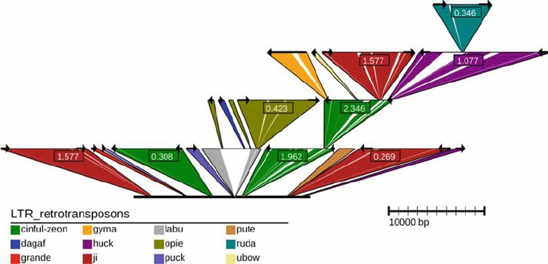

# Intro

TEnest is a tool for finding and annotating transposable element (TE) insertions

This source code is marked as the v2 version (v2 pub here
https://pubmed.ncbi.nlm.nih.gov/23918438/, v1 pub here
https://pubmed.ncbi.nlm.nih.gov/18032588/)

Example of TEnest output

## Organism Repeat Databases:

Archive links from 2015

- [WHEAT](./WHEAT) (from archive.org
  [WHEAT.tar.gz](https://web.archive.org/web/20150806130046/http://www.public.iastate.edu/~imagefpc/Subpages/TE_nest/WHEAT.tar.gz))
- [RICE](./RICE) (from archive.org
  [RICE.tar.gz](https://web.archive.org/web/20150806130046/http://www.public.iastate.edu/~imagefpc/Subpages/TE_nest/RICE.tar.gz))
- [BARLEY](./BARLEY) (from archive.org
  [BARLEY.tar.gz](https://web.archive.org/web/20150806130046/http://www.public.iastate.edu/~imagefpc/Subpages/TE_nest/BARLEY.tar.gz))
- [MAIZE](./MAIZE) (from archive.org
  [source](https://web.archive.org/web/20150806130046/http://www.public.iastate.edu/~imagefpc/Subpages/TE_nest/MAIZE.tar.gz))

## TEnest v2 README.txt

See also the v1 README.txt, it has a bit different content
https://github.com/cmdcolin/TEnest/tree/v1.0.0 adapted from the webpage at this
archive link in the 2010 copy of the page
https://web.archive.org/web/20100508181248/http://www.public.iastate.edu/~imagefpc/Subpages/te_nest.html

This v2 README is adapted from this 2015 copy of the same page
https://web.archive.org/web/20150806130028/http://www.public.iastate.edu/~imagefpc/Subpages/TE%20nest%202.0%20Readme.txt

### Overview

TEnest annotates TE insertions in a given input sequence. A repeat database is
used to identify TEs and to provide the reference for reconstructing degraded
TEs to their ancestral state. The nesting structure of TEs is determined by
analysis of TE insertion locations; age since insertion of LTR retrotransposons
is calculated from LTR divergence. A graphical display of the annotated TEs is
provided to visualize the chronological nesting structure. Both a web version
and a downloadable linux command line version of TEnest are available; in the
following descriptions the command line version is discussed. Many, but not all
of the explained options are also available on the web version of TEnest.

### Transposable Element Sequence Databases

TEnest utilizes organism specific TE databases to annotate repeats by sequence
alignment. Several pre-constructed TE databases are supplied with TEnest and
also available on the online PlantGDB [13] version of TEnest. Pre-constructed TE
databases include maize, rice, wheat and Hordeum vulgare (barley). A TEnest
database consists of two files per organism; full-length sequences for all TEs
in multi-FASTA format [14], and a four column table with an entry for each TE in
the multi-FASTA file. The TEnest database sequence and table files are named
first by organism and appended with `_TEnest.fasta` and `_TEnest.table`,
respectively. Users can switch between organism TE databases using the option
`--org organism`.

The TEnest database table has four tab-delimited columns. The first is the TE
name, and corresponds to the header of the full-length TE sequence with the
right chevron removed and trimmed at the first white space. Therefore, '>opie
retrotransposon' becomes 'opie'. The second column is the classification of this
TE. This is a one-word designator from a controlled list, and as such, only the
following classification terms can be used: LTR_retrotransposon,
Non-LTR_retrotransposon, DNA_transposon. However this controlled list can be
changed by using the options `--te_controlled_list_ltr` for LTR
retrotransposons, `--te_controlled_list_other` for non-LTR retrotransposons and
DNA transposons, and entering the lists of the altered classification names for
each of the options in double quotes. The last two columns are reserved only for
LTR retrotransposons. An LTR is defined here by the start and stop coordinates
from the full-length TE. Either the right- or left-most LTR coordinate positions
can be used.

Construction of a custom TE database is also possible. Users can add to one of
the existing pre-constructed databases, remove TEs from one of the available
databases, or construct a fully novel TE database. To add TEs to an existing
database, copy the original database files to newly named file,
`maize_TEnest.fasta` becomes `maize_custom_TEnest.fasta`, and likewise for the
table file. New full-length TE sequences can be appended to the new fasta file
and new entries are added to the table file. If the new entry is an LTR
retrotransposon, be sure to enter coordinates for the LTR location. Finally
point TEnest to the new sequence database by using the option --org
maize_custom. The process is much easier to remove a TE from the sequence
database. Simply changing the classification field in the sequence database
table to a non-approved value will cause TEnest to ignore the TE from analysis.
To construct a new TEnest sequence database, follow the above descriptions to
create both the full-length multi-FASTA TE sequence file and the associated
table, making sure the TE classifications agree with the controlled TE list.

### Installing TEnest

TEnest comes packaged with the TEnest.pl perl program, the graphical display
program of TEnest, svg_ltr.pl, the TEnest sequence databases, and a
long-sequence submission script split_TEnest.pl explained in the special
analysis section (2.4.6 below). TEnest utilizes two third-party software
programs that must be obtained from their respective sources; NCBI BLAST [12]
for the quick identification of potential TE alignment regions, and LALIGN [15]
(available at http://faculty.virginia.edu/wrpearson/fasta/fasta2/) from the
FASTA2 software suite [16] for local alignments of TEs to the reference
sequence.

Once BLAST and LALIGN are installed, download the zipped TEnest.tar.gz file and
the TE database files. Move them to the installation directory and unzip with
the command `tar --xzf \*.tar.gz`. Several parameters in the TEnest program must
be updated to integrate each of the BLAST and LALIGN program capabilities. Open
the TEnest.pl file for editing and change each of the following location
variables to point to the correct files or directories:

#### Database location:

Point this to the directory where your TEnest database files are found. For
example, if the maize_TEnest.fasta and maize_TEnest.table are found.

`$db_directory = '/home/user/TEnest/DB';`

#### Output location:

The default location for TEnest output is your current working directory.
However you can alter this to always write to the same location.

`$output_directory = '/home/user/TEnest';`

#### NCBI-BLAST Executables:

The path needed to run BLAST. If blastall is in your path this can be left
blank.

`$blast_directory = '/usr/local/bin';`

#### FASTA LALIGN Executable:

The path needed to run LALIGN. If LALIGN is in your path this can be left blank.

`$lal_directory = '/usr/local/bin/FASTA2';`

Once complete, save and close the TEnest.pl program. Make the file executable
with the command `chmod +x TEnest.pl`. Add the TEnest directory to your
executable path.

### Running TEnest

The general command for a TEnest analysis is
`TEnest.pl my_input.fasta [options]`.

Many options are available for fine tuning and customizing TEnest runs. Each of
these options can be entered via the command line; they are explained below by
section corresponding to the different processes of TEnest.

#### LTR Identification

In the first stage of TEnest, LTR sequences are extracted from the TE database
and aligned to the input sequence. A two-phase alignment process designed to
provide quick but accurate alignments over long sequence regions is accomplished
using BLAST coupled with a pairwise alignment. Nucleotide BLAST gives a TEnest a
very general overview of where TEs may reside on the input sequence. Due to
their sequence similarity multiple TEs may be identified at the same location on
the input sequence by the BLAST alignment. Each of the regions identified by
BLAST are then put into a pairwise local alignment process using LALIGN. Here a
decision is made to identify the best-matching TE also finding the exact start
and stop positions of the match.

Once alignments are complete, a set of fragmented LTR annotations have been
created. Progressing through each TE, the fragments are joined to recreate full
LTR sequences. There are multiple reasons LTRs might be fragmented: there may
differences between the input sequence version and the database version; nested
insertions of TEs may have caused a sequence split and distance separation
within the LTR; or sequence gaps or mis-assemblies have created an artificial
split. In any case, recombination attempts to identify LTR fragments and create
full-length groups. All sequential LTR fragment combinations are created and
their LTR-based coordinates are considered for re-combination possibilities.

Once full-length LTR sequences have been recombined, TEnest enters the LTR
pairing phase where the left and right LTRs of a retrotransposon are identified.
Due to the insertion process of LTR retrotransposons, the left and right LTR are
sequence twins at the time of insertion. Over evolutionary time the two LTRs
will accumulate mutations independently [17]. TEnest uses these mutations to
identify a paired set of LTRs. The left and right LTRs of a retrotransposon will
have more similar sequence to each other than to other LTRs of the same TE type.
The base substitution rate (BSR) between all LTRs is calculated via LTR
alignments, the LTR with most similar sequences are paired together. BSR is
determined by the amount of single mutations between the two LTRs divided by the
LTR alignment length. A maximum distance between left and right LTRs can be used
to prevent unlikely long range TE insertions. Also, a filtering process for LTR
pairing can be used to speed up the process and prevent incorrect combinations.
When the option `--ltr_find_LR` is used, TEnest will attempt to designate each
LTR as either a left or right copy prior to the pairing process by identifying a
sequence junction between the LTR and internal region. Not all LTRs will be able
to be classified as left or right if the junction sequence is not present. Left,
right and unknown designated LTRs are then sent to the LTR pairing process where
left-left, right-right and right-left (accounting for reverse-complementation)
combinations are excluded. Finally, age since insertion in Mya is calculated,
the BSR is divided by two times the substitution rate in repetitive regions in
grasses (1.3 x 10-8) [6, 7]. LTRs that are not identified as paired will be
classified as solo-LTRs.

### Alignment Options

- `--ltr_blast_cutoff` Expectation value of the LTR BLASTN [1e-01]

- `--ltr_gap_open` LTR alignment gap open (LALIGN --f parameter) [30]

- `--ltr_gap_ext` LTR alignment gap extension (LALIGN --g parameter) [15]

- `--ltr_gap_rep` LTR alignments to report within sub-region (LALIGN --k
  parameter) [7]

- `--ltr_lal_score` Parsed expectation value of the LTR local alignment, where
  20 equals 1e-20 [20]

### LTR Reconstruction Options

- `--ltr_smallest` Shortest length in bp of LTR fragment allowed to attempt LTR
  reconstruction. Very small fragments may be non-TE hits and will exponentially
  inflate the powerset function. [25]

- `--ltr_overlap` Length in bp of LTR-based coordinates to allow when combining
  LTR fragments in the LTR alignment phase. A size of 0 will allow no overlap.
  [25]

- `--ltr_full_shortest` Shortest length in bp of LTRs after reconstruction. Any
  LTRs less than this value will be ignored. [50]

- `--ltr_pwr_max` Longest length in bp that the gap between LTR fragments can
  span. If the length between two fragments is greater the sections cannot be
  joined. [100000]

- `--ltr_bad_set` LTRs are reconstructed using their LTR-based coordinates to
  identify the entire LTR sequence. Two regions with alike positions cannot
  belong to the same LTR insertion and therefore do not need to attempt
  reconstruction. This parameter allows wobble between calling two LTR fragments
  alike, for example a value of 5 will identify LTRs with coordinates 100-200
  and 102-197 as the same position. [5]

### LTR Pairing Options

- `--ltr_find_LR` Invoke the process to identify left and right LTRs prior to
  LTR pairing. T/F [T]

- `--ltr_bsr_length` Greatest distance in bp to allow between paired left and
  right LTRs. A value of 0 will not invoke distance restriction. [250000]

- `--bsr_gap_open` Paired LTR alignment gap open (LALIGN --f parameter) [12]

- `--bsr_gap_ext` Paired LTR alignment gap extension (LALIGN --g parameter) [4]

- `--bsr_max` Max BSR value to allow between LTR pairs [0.6]

## Identification of Internal Regions of LTR Retrotransposons

TEnest attempts to identify the internal regions for LTRs paired in the previous
processes. Starting with the smallest distanced set first, TEnest cycles through
all paired LTRs and aligns the internal sequence to the expected TE. Matching
sequence again goes through the recombination process described above to create
full-length joined internal regions. The annotated LTRs and internal region
sequences are masked (changed to 'N' but retaining the sequence length), and the
next longest spanning LTR set is analyzed. Masking the sequence prior to the
next alignment run prevents a nested TE from matching to multiple LTR pairs,
especially a problem when the same TE types are nested within one another.

### Local Alignment Options

- `--mid_gap_open` MID alignment gap open (LALIGN --f parameter) [75]

- `--mid_gap_ext` MID alignment gap extension (LALIGN --g parameter) [75]

- `--mid_gap_rep` MID alignments to report within sub-region (LALIGN --k
  parameter) [5]

- `--mid_lal_score` Parsed expectation value of the MID local alignment, where
  20 equals 1e-20 [20]

### Internal Region Reconstruction Options

- `--mid_smallest` Shortest length in bp of fragment allowed to enter
  reconstruction. Very small fragments may be non-TE hits and will exponentially
  inflate the powerset function. [25]

- `--mid_overlap` Length in bp of TE-based coordinates to allow when combining
  MID fragments in the alignment phase. A size of 0 will allow no overlap. [25]

- `--mid_bad_set` Basepair wobble range to consider MID fragments as identical
  and prevent both segments from entering powerset reconstruction. (see
  --ltr_bad_set for more information) [5]

## Fragmented Retrotransposons and non-LTR Transposable Elements

All un-annotated regions make one final pass through TE identification. In this
round the goal is to identify both fragmented LTR retrotransposons that did not
have a paired set of LTRs identified and non-LTR containing TEs. The full set of
TEs from the sequence database; LTR retrotransposons and other Class I
retrotransposons such as LINEs and SINEs, along with all Class II TEs go through
the previously described two phase alignment process. Again, split annotated TE
regions are joined through the recombination process also previously described.
After reconstruction, TEs are classified as fragmented. Their full annotation
length is compared to their expected full TE length, if 80% of the TE was
identified the annotation is promoted to a non-LTR full-length classification.

Finally, a round of conflict checks takes place. All combinations of joined or
paired TE sections are checked against all other joined groups to identify any
disagreeing recombined sets. TEnest requires all TE insertions to be annotated
in such a way as to show the chronological order of TE nesting. TEnest will not
group TE sections if a later recombination has rearranged the sequence order. If
a TE has nested within an older TE insertion, the full annotated sequence of the
newer TE must be found within the older TE. If sequence order conflicts are
seen, the TE with less sequence identity to the TE database entry is split into
non-conflicting fragmented sections.

## Local Alignment Options

- `--fn_gap_open` Fragment alignment gap open (LALIGN --f parameter) [75]

- `--fn_gap_ext` Fragment alignment gap extension (LALIGN --g parameter) [75]

- `--fn_gap_rep` Fragment alignments to report within sub-region (LALIGN --k
  parameter) [5]

- `--fn_lal_score` Parsed expectation value of the local alignment, where 20
  equals 1e-20 [20]

## Internal Region Reconstruction Options

- `--fn_smallest` Shortest length in bp of fragment allowed to enter
  reconstruction. Very small fragments may be non-TE hits and will exponentially
  inflate the powerset function. [25]

- `--fn_overlap` Length in bp of TE-based coordinates to allow when combining
  fragments in the alignment phase. A size of 0 will allow no overlap. [25]

- `--fn_bad_set` Basepair wobble range to consider fragments as identical and
  prevent both segments from entering powerset reconstruction. (see
  --ltr_bad_set for more information). [5]

### TEnest Output Files

Upon completion TEnest.pl provides three files. The first is a repeat-masked
FASTA format sequence file similar to the output of RepeatMasker [18]. The
second is a generic feature format version 3 (GFF3) output of the nested TE
annotations for use in genome viewers such as GBrowse [19]. The third is a
coordinate file of the annotated TEs identified in the input sequence. This file
is named with 'LTR' as the file extension, and is used as the input for the
TEnest graphical display program. Four sections in the LTR output file
correspond to the following annotation classifications: 1) solo-LTRs identified
as LTRs without pairs (SOLO), 2) full LTR retrotransposon composed of paired
LTRs and internal regions (PAIR), 3) fragmented LTR retrotransposons (FRAG),
and 4) full length non-LTR TEs (NLTR). The SOLO, FRAG and NLTR entries each have
a header line that contains the classification, a unique TE identifier, the TE
name, and the direction of the TE relative to the TE database reference
sequence. The following line contains the coordinates of the TE annotation,
first the start and stop positions in the input sequence, secondly the start and
stop positions in the reference TE sequence. The PAIR entries are similar to the
other sections with two differences. The PAIR header line has a BSR value
following the direction entry, and there are three coordinate lines
corresponding to the left (L), right (R), and internal regions (M). Output files
will be written to an output directory named in the format
`TEnest_date-time_my_input.fasta`.

### TEnest Graphical Display

Due to the nested structure of TE insertions, even with TEnest annotations the
arrangement of the repetitive sequence can be difficult to understand.
Therefore, TEnest provides an auxiliary graphical display program to visualize
the coordinate annotation file. As shown in, svg_ltr.pl reads the TEnest output
file `my_input.LTR` and provides a vector graphic based picture of nested TEs in
the input sequence.

The svg_ltr.pl picture displays the original input sequence as a black line
spanning the length of the display; however the annotated TEs have been removed
from the sequence length. TE insertions are shown as triangles, their flat top
represents their sequence length, and the bottom point represents the point of
TE insertion. Therefore, a summation of all horizontal lines including the black
input sequence and all triangle tops would equal the length of the input
sequence. LTR retrotransposons triangles have the LTRs shown with arrows at the
triangle top and have age since insertion shown in an internal box. A legend at
the bottom of the picture relates background triangle color to each displayed TE
name.

The basic command to run svg_ltr.pl is `svg_ltr.pl my_input.LTR [options]`. This
will produce the scalable vector graphics (SVG) format picture my_input.svg.
Many options are available for manipulating the TEnest graphic including subset
views, displaying specific annotation types, and adding third-party annotations
to the picture.

## Mapping Options

- `--map_pair` Include pair classified LTR retrotransposons. T/F [T]

- `--map_solo` Include solo classified LTRs. T/F [T]

- `--map_nltr` Include non-LTR classified TEs. T/F [T]

- `--map_frag` Include fragmented TE annotations. T/F [T]

- `--map_gene` Include third-party gene annotations. Gene annotations can be
  appended to the TEnest output file prior to running svg_ltr.pl. Similar to the
  description of the TEnest output file above, each gene entry has a first line
  in the form `GENE g0 F the gene name`, where 'g0' is a unique count identifier
  for this gene, 'F' is the gene direction and any additional entries in the
  line will be treated as the gene name. The second gene line contains the
  annotation coordinates in the form `g0 1001 1100 1 100 1501 1600 101 200`,
  groups of four coordinates representing exons with input sequence based start
  and stop positions and gene based start and stop positions. T/F [T]

- `--map_psdo` Include third-party pseudogene annotations. Similar to the
  --map_gene option above, but substitute PSDO for GENE and u0 for g0. T/F [T]

## Coordinate Options

- `--print_coords` Print coordinates on displayed annotations. Coordinates can
  be input sequence or TE based. A 'F' entry overrides the individual coordinate
  options below, a 'SEQ' or 'TE' entry then checks the individual coordinate
  option. F/SEQ/TE [F]

- `--pair_coords` Display pair classified coordinates. T/F [T]

- `--solo_coords` Display solo classified LTRs. T/F [T] --nltr_coords Display
  non-LTR classified TEs. T/F [T]

- `--frag_coords` Display fragmented TE coordinates. T/F [T]

- `--gene_coords` Display third-party gene coordinates. T/F [T]

- `--psdo_coords` Display third-party pseudogene coordinates. T/F [T]

## Display Options

- `--white_out` Draw white triangles within TE triangles for un-identified
  regions. T/F [T]

- `--age` Display MYA or BSR inside LTR retrotransposons. mya/bsr [mya]

- `--start` Trim the display to this starting position. Any annotations prior to
  this position will be ignored. []

- `--end` Trim the display to this end position. Any annotations found after
  this position will be ignored. []

- `--split` If --start or --end are used the coordinates may sever a TE
  annotation. T will trim the TE annotation and display the viewable fragment. F
  will not display any portion of the TE. T/F [T] SVG format pictures can be
  displayed directly in Mozilla Firefox version 2 or later
  (http://www.mozilla.com/firefox). The linux program rsvg
  (http://librsvg.sourceforge.net) is a convenient way to convert SVG files to
  png or jpeg format pictures. The command
  `rsvg --h 1000 my_input.svg my_input.png` will produce a publication quality
  image.

# Footnote

### Background

I (@cmdcolin) downloaded TEnest from the internet archive and am rehosting it on
github for posterity. The plantGDB cgi-bin instance is no longer alive, and I
thought that this tool makes such unique visualizations, that it deserved to be
kept alive

Software link
https://web.archive.org/web/20150806130046/http://www.public.iastate.edu/~imagefpc/Subpages/software.html

Downloaded from
https://web.archive.org/web/20150806130046/http://www.public.iastate.edu/~imagefpc/Subpages/te_nest.html

Original source code
https://web.archive.org/web/20150806130046/http://www.public.iastate.edu/~imagefpc/Subpages/TE_nest/TEnest_scripts.tar.gz

I believe this is TEnest v2, downloaded from a 2015 archive.org link.

### License

As far as I (@cmdcolin) knows, there is no license attached to the source code

### Concerns

I am just hosting this for software historical purposes. If you wish for this
repository to be taken down, contact me and I will do so!
